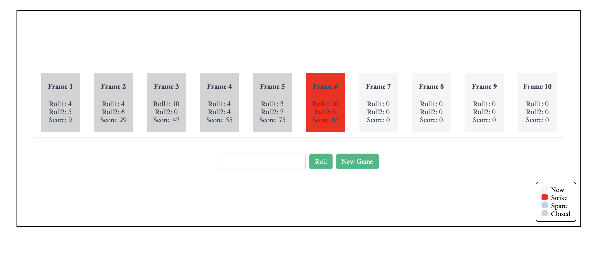

# BowlingGame

A bowling score calculator built with Angular and PrimeNG.
It allows users to enter rolls and automatically calculates frame scores.

## Bowling Rules

- Strike: 10 pins in first roll
- Spare: 10 pins in two rolls
- Score includes bonus rolls

## Screenshot

## Features

- Enter bowling rolls
- Automatic frame score calculation
- Strike and Spare detection
- New game functionality

## Tech Stack

- Angular 21.2.1
- Node.js 24.14.0
- PrimeNG 21.1.3
- TypeScript 5.9.2
- Jasmine / Karma (tests)

## Installation

Clone the repository:

git clone https://github.com/florinasas/bowling.git
cd bowling

Install dependencies:

npm install

## Run the Application

Start the development server:

ng serve

Open the app at:

http://localhost:4200

## Running Tests

Run unit tests:

ng test

